# OptiX 프로젝트 전체 클래스 다이어그램

## 프로젝트 아키텍처 개요

OptiX는 LED 디스플레이 광학 테스트를 위한 WPF 기반 애플리케이션으로, MVVM 패턴과 레이어드 아키텍처를 사용합니다.

### 주요 레이어
1. **Presentation Layer**: WPF Views & ViewModels (OPTIC, IPVS)
2. **Business Logic Layer**: Executors, Managers, Handlers
3. **Data Access Layer**: DLL Interface, INI File Management
4. **Cross-Cutting Concerns**: Logging, Communication, Common Utilities

---

## 전체 클래스 다이어그램

```mermaid
classDiagram
    %% ========================================
    %% Main Window Layer (애플리케이션 진입점)
    %% ========================================
    class MainWindow {
        -isDarkMode: bool
        -communicationServer: CommunicationServer
        -pageNavigationManager: PageNavigationManager
        -tooltipManager: TooltipManager
        -windowResizeManager: WindowResizeManager
        +ShowMainPage()
        +StartCommunicationServer()
        +StopCommunicationServer()
    }

    class PageNavigationManager {
        -mainWindow: MainWindow
        +ShowOpticPage()
        +ShowIPVSPage()
        +ShowManualPage()
        +ShowLUTPage()
        +ShowMainPage()
    }

    class TooltipManager {
        -mainWindow: MainWindow
        +SetDarkMode(bool)
    }

    class WindowResizeManager {
        -mainWindow: MainWindow
        +ToggleMaximize()
    }

    %% ========================================
    %% OPTIC Layer (광학 테스트)
    %% ========================================
    class OpticPage {
        -viewModel: OpticPageViewModel
        -dataTableManager: OpticDataTableManager
        -seqExecutor: OpticSeqExecutor
        -graphManager: GraphManager
        +InitializePage()
    }

    class OpticPageViewModel {
        -dataItems: ObservableCollection~DataTableItem~
        -currentZone: int
        -selectedWadIndex: int
        +TestStartCommand: ICommand
        +UpdateDataTableWithDllResult()
        +AddGraphDataPoint()
        +GetJudgmentForZone()
    }

    class OpticSeqExecutor {
        -dataTableManager: OpticDataTableManager
        -viewModel: OpticPageViewModel
        -graphManager: GraphManager
        -isTestStarted: bool
        -zoneTestCompleted: bool[]
        +StartTest()
        +StopTest()
        +InitializeZoneTestStates()
        -ExecuteSeqForZone()
        -CreateAllResultLogs()
    }

    class OpticDataTableManager {
        -dataTableGrid: Grid
        -wadComboBox: ComboBox
        -viewModel: OpticPageViewModel
        +CreateCustomTable()
        +GenerateDataFromStruct()
        +UpdateDataItem()
        +ResetDataTable()
    }

    class OpticJudgment {
        +JudgeZoneFromResults(): string
        +GetPatternJudgment(): string
        <<singleton>>
    }

    class OpticHelpers {
        +GetWadArrayIndex(): int
        +GetPatternArrayIndex(): int
        <<static>>
    }

    %% ========================================
    %% IPVS Layer (IPVS 테스트)
    %% ========================================
    class IPVSPage {
        -viewModel: IPVSPageViewModel
        -dataTableManager: IPVSDataTableManager
        -seqExecutor: IPVSSeqExecutor
        -graphManager: GraphManager
        +InitializePage()
    }

    class IPVSPageViewModel {
        -dataItems: ObservableCollection~DataTableItem~
        -currentZone: int
        -selectedWadIndex: int
        +TestStartCommand: ICommand
        +UpdateDataTableWithDllResult()
        +AddGraphDataPoint()
    }

    class IPVSSeqExecutor {
        -dataTableManager: IPVSDataTableManager
        -viewModel: IPVSPageViewModel
        -graphManager: GraphManager
        -isTestStarted: bool
        +StartTest()
        +StopTest()
        -ExecuteSeqForZone()
        -CreateAllResultLogs()
    }

    class IPVSDataTableManager {
        -dataTableGrid: Grid
        -wadComboBox: ComboBox
        -viewModel: IPVSPageViewModel
        +CreateCustomTable()
        +GenerateDataFromStruct()
        +UpdateDataItem()
    }

    class IpvsJudgment {
        +JudgeIPVSZone(): string
        +GetPointJudgment(): string
        <<singleton>>
    }

    class IPVSHelpers {
        +GetWadArrayIndex(): int
        <<static>>
    }

    %% ========================================
    %% DLL Management Layer (DLL 인터페이스)
    %% ========================================
    class DllManager {
        -isInitialized: bool
        -dllPath: string
        +Initialize(): bool
        +Reload(): bool
        +MTP_test()
        +IPVS_test()
        +PGTurn()
        +Meas_Turn()
        +Graycrushing()
        <<static>>
    }

    class DllFunctions {
        +CallMTPTestFunction(): (Output, bool)
        +CallIPVSTestFunction(): (Output, bool)
        +CallPGTurn(): bool
        +CallMeasTurn(): bool
        +CallPGPattern(): bool
        +CallGraycrushing(): (Output, bool)
        <<static>>
    }

    class SeqExecutionManager {
        -zoneContexts: ConcurrentDictionary~int,ZoneContext~
        -globalSeqStartTime: DateTime
        -globalSeqEndTime: DateTime
        +StartZoneSeq()
        +EndZoneSeq()
        +ExecuteMappedAsync(): bool
        +GetZoneContext(): ZoneContext
        +GetStoredZoneResult(): Output?
        <<static>>
    }

    class ZoneContext {
        +ZoneNumber: int
        +SharedInput: Input
        +SharedOutput: Output
        +SeqStartTime: DateTime
        +SeqEndTime: DateTime
        +Reset()
        +ConfigureInput()
    }

    class DllResultHandler {
        +ProcessOpticResult(): string
        +ProcessIPVSResult(): string
    }

    class ResultLogManager {
        +CreateAllResultLogs(): bool
        +CreateCIMForZone(): bool
        +CreateEECPLog(): bool
        +CreateSummaryLog(): bool
        <<static>>
    }

    class SequenceCacheManager {
        -opticSequence: Queue~string~
        -ipvsSequence: Queue~string~
        +LoadOpticSequence()
        +LoadIPVSSequence()
        +GetOpticSequenceCopy(): Queue~string~
        +GetIPVSSequenceCopy(): Queue~string~
        <<singleton>>
    }

    class DllConstants {
        +OPTIC_DATA_SIZE: int
        +IPVS_DATA_SIZE: int
        +MAX_WAD_COUNT: int
        +MAX_PATTERN_COUNT: int
        +DEFAULT_CURRENT_POINT: int
        <<static>>
    }

    %% ========================================
    %% DLL Structures (데이터 구조체)
    %% ========================================
    class Input {
        +CELL_ID: string
        +INNER_ID: string
        +total_point: int
        +cur_point: int
        <<struct>>
    }

    class Output {
        +data: Pattern[]
        +IPVS_data: Pattern[]
        +measure: Pattern[]
        +lut: LUTParameter[]
        <<struct>>
    }

    class Pattern {
        +x: float
        +y: float
        +u: float
        +v: float
        +L: float
        +cur: float
        +eff: float
        +result: int
        <<struct>>
    }

    class LUTParameter {
        +max_lumi: float
        +max_index: float
        +gamma: float
        +black: float
        <<struct>>
    }

    %% ========================================
    %% Common Utilities Layer (공통 유틸리티)
    %% ========================================
    class GlobalDataManager {
        -iniData: Dictionary~string,string~
        -iniManager: IniFileManager
        -mtpZoneInfo: Dictionary~int,(string,string)~
        -ipvsZoneInfo: Dictionary~int,(string,string)~
        +Initialize()
        +GetValue(): string
        +SetValue()
        +GetZoneInfo(): (string,string)
        +GetIPVSZoneInfo(): (string,string)
        +Reload()
        <<static>>
    }

    class IniFileManager {
        -iniFilePath: string
        +ReadValue(): string
        +WriteValue()
        +ReadSection(): Dictionary~string,string~
    }

    class ErrorLogger {
        +Log()
        +LogException()
        +LogDllError()
        +LogFileError()
        <<static>>
    }

    class GraphManager {
        -graphContent: Grid
        -graphScrollViewer: ScrollViewer
        -cachedDataPoints: List~GraphDataPoint~
        +InitializeGraphArea()
        +CreateDynamicGraph()
        +AddDataPoint(): List~GraphDataPoint~
        +UpdateGraphDisplay()
        +ClearDataPoints()
    }

    class GraphDataPoint {
        +ZoneNumber: int
        +Judgment: string
        +GlobalIndex: int
        +Timestamp: DateTime
    }

    class DataTableItem {
        +Zone: string
        +CellId: string
        +InnerId: string
        +Category: string
        +Point: string
        +X: string
        +Y: string
        +L: string
        +Current: string
        +Efficiency: string
        +ErrorName: string
        +Tact: string
        +Judgment: string
    }

    class ThemeManager {
        +SetMainWindowDarkMode()
        +SetMainWindowLightMode()
        +ApplyDarkModeToPage()
        +ApplyLightModeToPage()
        <<static>>
    }

    class MonitorLogService {
        -logQueues: ConcurrentQueue~string~[]
        +Log()
        +Clear()
        +GetLogs(): List~string~
        <<singleton>>
    }

    class JudgmentStatusManager {
        -okCount: int
        -ngCount: int
        -ptnCount: int
        +UpdateCounts()
        +ResetCounts()
        +GetCounts(): (int,int,int)
        <<singleton>>
    }

    class ZoneButtonManager {
        +CreateZoneButtons(): List~Button~
        +UpdateZoneButtonStyles()
        <<static>>
    }

    %% ========================================
    %% Communication Layer (통신)
    %% ========================================
    class CommunicationServer {
        -tcpListener: TcpListener
        -connectedClients: List~TcpClient~
        -isRunning: bool
        +StartServerAsync(): bool
        +StopServerAsync()
        +SendMessageToAllClientsAsync()
        +MessageReceived: EventHandler~string~
        +ConnectionStatusChanged: EventHandler~bool~
    }

    class CommunicationLogger {
        +WriteLog()
        <<static>>
    }

    %% ========================================
    %% Result Log Layer (결과 로그)
    %% ========================================
    class OpticCIMLogger {
        +GenerateCIMFile(): bool
        <<static>>
    }

    class IPVSCIMLogger {
        +GenerateCIMFile(): bool
        <<static>>
    }

    %% ========================================
    %% Language Layer (다국어)
    %% ========================================
    class LanguageManager {
        -currentLanguage: string
        -translations: Dictionary~string,string~
        +SetLanguage()
        +GetTranslation(): string
        +LanguageChanged: EventHandler
        <<static>>
    }

    class LanguageHelper {
        +ApplyToMainWindow()
        +ApplyToOpticPage()
        +ApplyToIPVSPage()
        <<static>>
    }

    %% ========================================
    %% 관계 정의 (Relationships)
    %% ========================================

    %% Main Window Relationships
    MainWindow --> PageNavigationManager : uses
    MainWindow --> TooltipManager : uses
    MainWindow --> WindowResizeManager : uses
    MainWindow --> CommunicationServer : manages
    MainWindow --> ThemeManager : uses
    MainWindow --> LanguageManager : uses
    MainWindow --> GlobalDataManager : uses

    PageNavigationManager --> OpticPage : creates
    PageNavigationManager --> IPVSPage : creates

    %% OPTIC Layer Relationships
    OpticPage --> OpticPageViewModel : has
    OpticPage --> OpticDataTableManager : has
    OpticPage --> OpticSeqExecutor : has
    OpticPage --> GraphManager : has

    OpticPageViewModel --> DataTableItem : manages
    OpticPageViewModel --> DllManager : checks

    OpticSeqExecutor --> OpticPageViewModel : updates
    OpticSeqExecutor --> OpticDataTableManager : uses
    OpticSeqExecutor --> GraphManager : uses
    OpticSeqExecutor --> SeqExecutionManager : uses
    OpticSeqExecutor --> SequenceCacheManager : uses
    OpticSeqExecutor --> GlobalDataManager : uses
    OpticSeqExecutor --> ResultLogManager : creates logs
    OpticSeqExecutor --> ErrorLogger : logs

    OpticDataTableManager --> OpticPageViewModel : uses
    OpticDataTableManager --> OpticJudgment : uses
    OpticDataTableManager --> OpticHelpers : uses
    OpticDataTableManager --> GlobalDataManager : uses
    OpticDataTableManager --> SeqExecutionManager : gets results

    %% IPVS Layer Relationships
    IPVSPage --> IPVSPageViewModel : has
    IPVSPage --> IPVSDataTableManager : has
    IPVSPage --> IPVSSeqExecutor : has
    IPVSPage --> GraphManager : has

    IPVSPageViewModel --> DataTableItem : manages
    IPVSPageViewModel --> DllManager : checks

    IPVSSeqExecutor --> IPVSPageViewModel : updates
    IPVSSeqExecutor --> IPVSDataTableManager : uses
    IPVSSeqExecutor --> GraphManager : uses
    IPVSSeqExecutor --> SeqExecutionManager : uses
    IPVSSeqExecutor --> SequenceCacheManager : uses
    IPVSSeqExecutor --> GlobalDataManager : uses
    IPVSSeqExecutor --> ResultLogManager : creates logs
    IPVSSeqExecutor --> ErrorLogger : logs

    IPVSDataTableManager --> IPVSPageViewModel : uses
    IPVSDataTableManager --> IpvsJudgment : uses
    IPVSDataTableManager --> IPVSHelpers : uses
    IPVSDataTableManager --> GlobalDataManager : uses
    IPVSDataTableManager --> SeqExecutionManager : gets results

    %% DLL Layer Relationships
    DllManager --> ErrorLogger : logs
    DllManager --> GlobalDataManager : gets path

    DllFunctions --> DllManager : calls P/Invoke
    DllFunctions --> Input : marshals
    DllFunctions --> Output : marshals
    DllFunctions --> ErrorLogger : logs

    SeqExecutionManager --> ZoneContext : manages
    SeqExecutionManager --> DllFunctions : executes
    SeqExecutionManager --> Input : uses
    SeqExecutionManager --> Output : uses
    SeqExecutionManager --> ErrorLogger : logs

    ZoneContext --> Input : contains
    ZoneContext --> Output : contains

    DllResultHandler --> Output : processes
    DllResultHandler --> OpticJudgment : uses
    DllResultHandler --> IpvsJudgment : uses
    DllResultHandler --> OpticDataTableManager : updates
    DllResultHandler --> IPVSDataTableManager : updates

    ResultLogManager --> Output : reads
    ResultLogManager --> OpticCIMLogger : uses
    ResultLogManager --> IPVSCIMLogger : uses
    ResultLogManager --> GlobalDataManager : gets paths
    ResultLogManager --> ErrorLogger : logs

    SequenceCacheManager --> GlobalDataManager : gets paths
    SequenceCacheManager --> ErrorLogger : logs

    %% Structure Relationships
    Output --> Pattern : contains array
    Output --> LUTParameter : contains array

    %% Common Utilities Relationships
    GlobalDataManager --> IniFileManager : uses
    GlobalDataManager --> ErrorLogger : logs

    GraphManager --> GraphDataPoint : manages
    GraphManager --> GlobalDataManager : uses

    %% Communication Relationships
    CommunicationServer --> CommunicationLogger : logs
    MainWindow --> CommunicationLogger : uses

    %% Language Relationships
    LanguageHelper --> LanguageManager : uses
```



---

## 레이어별 상세 설명

### 1. Presentation Layer (프레젠테이션 레이어)

**OPTIC 모듈**
- `OpticPage`: 광학 테스트 UI (XAML View)
- `OpticPageViewModel`: MVVM 패턴의 데이터 바인딩 및 비즈니스 로직
- `OpticDataTableManager`: 측정 데이터 테이블 UI 관리
- `OpticSeqExecutor`: SEQ 시퀀스 실행 흐름 제어

**IPVS 모듈**
- `IPVSPage`: IPVS 테스트 UI (XAML View)
- `IPVSPageViewModel`: MVVM 패턴의 데이터 바인딩
- `IPVSDataTableManager`: IPVS 데이터 테이블 UI 관리
- `IPVSSeqExecutor`: IPVS SEQ 시퀀스 실행 흐름 제어

---

### 2. Business Logic Layer (비즈니스 로직 레이어)

**SEQ 실행 관리**
- `SeqExecutionManager`: Zone별 컨텍스트 관리 및 DLL 함수 매핑 실행
- `ZoneContext`: Zone별 Input/Output 공유 컨텍스트 (Thread-safe)
- `SequenceCacheManager`: INI 파일에서 시퀀스 로드 및 캐싱

**결과 처리**
- `DllResultHandler`: DLL 결과를 UI에 맞게 가공
- `OpticJudgment`: OPTIC 판정 로직 (OK/NG/PTN/R/J)
- `IpvsJudgment`: IPVS 판정 로직
- `ResultLogManager`: EECP, CIM, Summary, Validation 로그 생성

**그래프 관리**
- `GraphManager`: Zone별 판정 그래프 렌더링 (OK/R/J/PTN 분리)
- `GraphDataPoint`: 그래프 데이터 포인트 (Timestamp 포함)

---

### 3. Data Access Layer (데이터 액세스 레이어)

**DLL 인터페이스**
- `DllManager`: C++ DLL 초기화 및 P/Invoke 함수 선언
- `DllFunctions`: DLL 함수 래퍼 (Marshal 처리 포함)
- `DllStructures`: Input, Output, Pattern, LUTParameter 구조체 정의

**INI 파일 관리**
- `GlobalDataManager`: INI 데이터를 메모리에 캐싱 (성능 최적화)
- `IniFileManager`: INI 파일 읽기/쓰기 저수준 API

---

### 4. Cross-Cutting Concerns (횡단 관심사)

**통신**
- `CommunicationServer`: TCP/IP 서버 (외부 운영 프로그램과 통신)
- `CommunicationLogger`: 통신 로그 기록

**로깅**
- `ErrorLogger`: 에러 및 디버그 로그
- `MonitorLogService`: SEQ 실행 모니터 로그 (Zone별 큐)

**테마 및 언어**
- `ThemeManager`: 다크/라이트 모드 전환
- `LanguageManager`: 다국어 지원 (한국어/영어)
- `LanguageHelper`: UI 요소에 언어 적용

**UI 관리**
- `JudgmentStatusManager`: 판정 현황 카운터 (OK/NG/PTN)
- `ZoneButtonManager`: Zone 버튼 동적 생성 및 스타일 관리

---

## 핵심 데이터 흐름

### OPTIC 테스트 실행 흐름

```
1. 사용자 클릭 (OpticPage)
   ↓
2. TestStartCommand (OpticPageViewModel)
   ↓
3. StartTest() (OpticSeqExecutor)
   ↓
4. Zone별 병렬 실행 (ExecuteSeqForZone)
   ↓
5. SEQ 순서대로 함수 실행 (SeqExecutionManager.ExecuteMappedAsync)
   ↓
6. DLL 함수 호출 (DllFunctions → DllManager P/Invoke)
   ↓
7. 결과 저장 (ZoneContext.SharedOutput)
   ↓
8. UI 업데이트 (DllResultHandler → OpticDataTableManager)
   ↓
9. 그래프 업데이트 (GraphManager)
   ↓
10. 로그 생성 (ResultLogManager → OpticCIMLogger)
```

### Zone 컨텍스트 관리 흐름

```
1. StartZoneSeq(zoneId) 호출
   ↓
2. ZoneContext 생성 및 초기화
   ↓
3. Input 설정 (CELL_ID, INNER_ID, total_point)
   ↓
4. SEQ 함수들이 SharedInput/SharedOutput 공유 사용
   ↓
5. EndZoneSeq(zoneId) 호출 (종료 시간 기록)
   ↓
6. GetStoredZoneResult()로 결과 조회
   ↓
7. CIM 로그 생성
```

---

## 주요 디자인 패턴

### 1. MVVM (Model-View-ViewModel)
- **View**: `OpticPage.xaml`, `IPVSPage.xaml`
- **ViewModel**: `OpticPageViewModel`, `IPVSPageViewModel`
- **Model**: `DataTableItem`, `Output`, `Pattern`

### 2. Singleton
- `SequenceCacheManager`: 시퀀스 캐싱 (한 번만 로드)
- `OpticJudgment`, `IpvsJudgment`: 판정 로직 인스턴스
- `MonitorLogService`: Zone별 로그 큐 관리
- `JudgmentStatusManager`: 판정 현황 카운터

### 3. Static Manager
- `DllManager`: DLL 초기화 및 P/Invoke 관리
- `GlobalDataManager`: INI 데이터 캐싱
- `SeqExecutionManager`: Zone 컨텍스트 관리
- `ThemeManager`, `LanguageManager`: 전역 설정 관리

### 4. Manager Pattern
- 각 레이어별로 Manager 클래스가 책임을 분리하여 관리
- 예: `OpticDataTableManager`, `PageNavigationManager`, `ResultLogManager`

### 5. Context Pattern
- `ZoneContext`: Zone별 Input/Output을 하나의 컨텍스트로 통합 관리
- Thread-safe한 `ConcurrentDictionary` 사용

---

## 멀티스레딩 및 동기화

### Thread-Safe 구현

1. **SeqExecutionManager**
   - `ConcurrentDictionary<int, ZoneContext>` 사용
   - Zone별 병렬 실행 (Task.Run)
   - Lock 객체로 전역 시간 설정 보호

2. **MonitorLogService**
   - Zone별 `ConcurrentQueue<string>` 사용
   - 로그 기록 시 락 없이 비동기 추가

3. **CommunicationServer**
   - 클라이언트 목록 관리 시 `lock (clientsLock)` 사용
   - 비동기 메시지 송수신 (`async/await`)

---

## 의존성 주입 및 결합도

### 느슨한 결합 (Loose Coupling)
- ViewModel은 View를 직접 참조하지 않음 (Event 방식)
- Manager 클래스들은 Interface 대신 구체 클래스 사용 (WPF 환경 특성)

### 강한 결합 (Tight Coupling)
- `OpticSeqExecutor` ↔ `OpticPageViewModel`: 필드로 직접 참조
- `OpticDataTableManager` ↔ `OpticPageViewModel`: 생성자 주입

### 의존성 역전 원칙 (Dependency Inversion)
- `DllManager`는 추상화가 아닌 구체 클래스로 정적 메서드 제공
- 전역 상태 관리로 인한 테스트 어려움 (향후 개선 필요)

---

## 성능 최적화 전략

### 1. INI 파일 캐싱
- `GlobalDataManager`가 프로그램 시작 시 전체 INI 데이터를 메모리에 로드
- 파일 I/O 최소화

### 2. 시퀀스 캐싱
- `SequenceCacheManager`가 Sequence_Optic.ini, Sequence_IPVS.ini를 한 번만 로드
- Zone별 실행 시 복사본 사용

### 3. Zone별 병렬 실행
- `Task.WhenAll`로 모든 Zone 동시 실행
- UI 블록 방지를 위한 비동기 처리 (`async/await`)

### 4. UI 업데이트 최적화
- 로그 생성을 UI 업데이트보다 뒤로 배치 (백그라운드 Task)
- 배치 업데이트 지원 (`suppressNotification` 파라미터)

---

## 확장성 고려사항

### 1. 새로운 테스트 타입 추가 (예: LUT, Manual)
- 기존 OPTIC/IPVS 모듈 구조 복사
- `SeqExecutionManager`에 새로운 함수 매핑 추가
- `DllManager`에 새로운 DLL 함수 선언

### 2. 새로운 통신 프로토콜 추가
- `CommunicationServer` 확장 또는 새로운 서버 클래스 생성
- `MainWindow`에서 서버 인스턴스 관리

### 3. 새로운 로그 형식 추가
- `ResultLogManager`에 새로운 메서드 추가
- 각 모듈별 Logger 클래스 생성 (예: `OpticEECPLogger`)

---

## 주의사항 및 개선 제안

### 현재 아키텍처의 한계

1. **전역 상태 의존**
   - Static 클래스가 많아 단위 테스트 어려움
   - 향후 DI Container 도입 고려 (예: Microsoft.Extensions.DependencyInjection)

2. **강한 결합**
   - Executor와 ViewModel 간 직접 참조
   - Interface 추상화 부족

3. **예외 처리 일관성**
   - 일부 메서드는 예외를 throw, 일부는 bool 반환
   - 통일된 예외 처리 전략 필요

### 개선 제안

1. **Interface 도입**
```csharp
public interface ISeqExecutor
{
    void StartTest();
    void StopTest();
}

public class OpticSeqExecutor : ISeqExecutor { ... }
public class IPVSSeqExecutor : ISeqExecutor { ... }
```

2. **의존성 주입 컨테이너**
```csharp
services.AddSingleton<IDllManager, DllManager>();
services.AddSingleton<IGlobalDataManager, GlobalDataManager>();
services.AddScoped<IOpticSeqExecutor, OpticSeqExecutor>();
```

3. **Command Pattern 확장**
```csharp
public interface ICommand<T>
{
    Task<T> ExecuteAsync(CancellationToken cancellationToken);
}

public class StartTestCommand : ICommand<bool> { ... }
```

---

## 참조 관계 요약표

| 레이어 | 주요 클래스 | 참조하는 레이어 |
|--------|-------------|-----------------|
| Presentation | OpticPage, IPVSPage | Business Logic, Common |
| Business Logic | OpticSeqExecutor, SeqExecutionManager | Data Access, Common |
| Data Access | DllManager, GlobalDataManager | Common |
| Cross-Cutting | ErrorLogger, ThemeManager | (모든 레이어에서 참조) |

---

## 결론

OptiX 프로젝트는 **레이어드 아키텍처**와 **MVVM 패턴**을 기반으로 설계되었으며, 각 레이어가 명확한 책임을 가지고 있습니다. DLL 관리, SEQ 실행, 결과 처리, UI 렌더링이 독립적으로 동작하면서도 효율적으로 협력합니다.

**강점**:
- 명확한 레이어 분리
- Zone별 병렬 처리로 높은 성능
- INI 파일 캐싱으로 빠른 데이터 접근
- WPF MVVM 패턴 준수

**개선 필요 영역**:
- 전역 상태 의존도 감소 (DI 도입)
- Interface 추상화 강화
- 단위 테스트 용이성 향상

이 다이어그램을 통해 OptiX 프로젝트의 전체 구조와 클래스 간 참조 관계를 명확히 파악할 수 있습니다.

